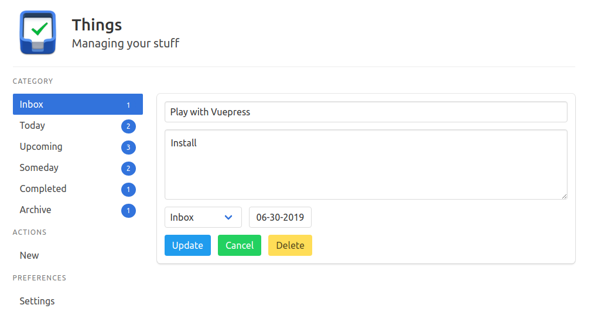

# Things

<p align='center'></p>

### Setup
```
yarn install
```

### Things API
```
> cd things/api
> node index.js
Connected to SQLite Database things...
Server listening at http://localhost:4567
```

### Things Vue
```
> cd things
> yarn serve
App running at:
- Local: http://localhost:8080/
```
